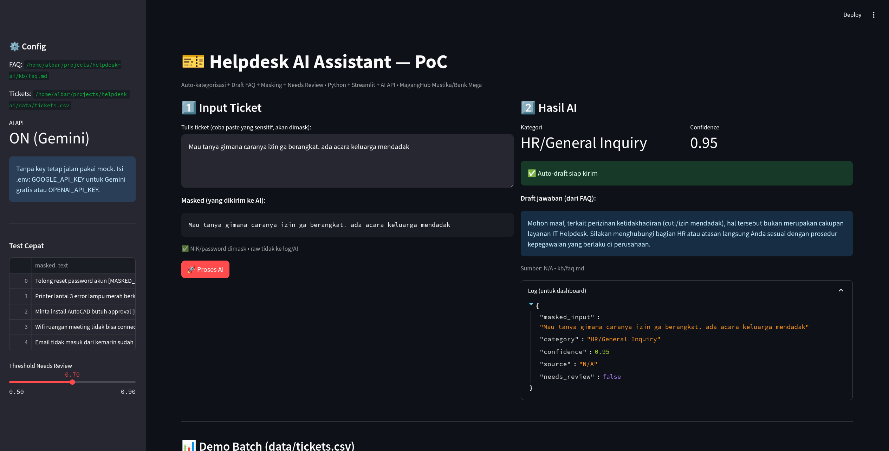

# Helpdesk AI Assistant — Mini PoC (MagangHub)

Demo: auto-kategorisasi ticket + draft jawaban FAQ + masking + human-in-the-loop.

> **Mustika & Bank Mega ready** — ticketing + RAG FAQ + secure masking + dashboard

## Demo Screenshot

*Auto-kategorisasi + Masked PII + Draft FAQ + Needs Review*

## Cara Run (2 menit)
```bash
python -m venv .venv && source .venv/bin/activate
pip install -r requirements.txt
streamlit run app.py
```
Buka http://localhost:8501

Tanpa OPENAI_API_KEY = pakai mock rule-based (tetap jalan). Dengan key = pakai AI API beneran.

## Fitur
- Masking NIK/password sebelum ke AI
- Kategorisasi: Password / Software / Hardware-Printer / Network / Email / ERP
- RAG FAQ: jawab dari kb/faq.md + tampil sumber + confidence
- Needs Review kalau confidence <0.7 atau sensitif

## Struktur
- app.py — UI + logic
- kb/faq.md — knowledge base
- data/tickets.csv — 30 ticket dummy mask
